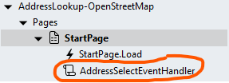

# OpenStreetMap Address Lookup

A search API looks up a location from a textual description or address. 

This module integrates the free Nominatim API of OpenStreetMap. Please make sure you adhere to the [usage policies](https://operations.osmfoundation.org/policies/nominatim/). 


https://github.com/user-attachments/assets/8284de7b-7015-49fd-af5a-355c7c66f75a


## Version 
1.0 - initial

# Setup

## Requirements
The module calls the https://nominatim.openstreetmap.org/search API to enable address lookups and requires an Internet connection

## Application Setup
1. Check the *Enable Style Sheet* checkbox in the application properties

## Global Script
1. Create a Global Script called "OpenStreetMapLookup"
2. Add the input parameters below to the Global Script
   1. ClassName
   2. CountryCodes
   3. MaxResultsCount
3. Drag a *JavaScript* action into the script
4. Add the Javascript below into the JavaScript code property
```javascript
/* Stadium Script v1.0 https://github.com/stadium-software/address-lookup-openstreetmap */
let classname = ~.Parameters.Input.ClassName;
let limit = ~.Parameters.Input.MaxResultsCount;
let countryCodes = ~.Parameters.Input.CountryCodes;
if (Array.isArray(countryCodes) && countryCodes.length > 0) {
    countryCodes = "&countrycodes=" + countryCodes.join(",");
} else {
    countryCodes = "";
}
if (isNaN(limit)) limit = 10;
if (!classname) {
     console.error("The 'ClassName' parameter is required");
     return false;
}
let lookupContainer = document.querySelectorAll("." + classname);
if (lookupContainer.length == 0) {
    console.error("The class '" + classname + "' is not assigned to any container");
    return false;
} else if (lookupContainer.length > 1) {
    console.error("The class '" + classname + "' is assigned to multiple containers");
    return false;
} else { 
    lookupContainer = lookupContainer[0];
}
lookupContainer.classList.add("address-lookup-osm");
let lookupInput = lookupContainer.querySelector("input[type='text']");
let scope = this;
let getObjectName = (obj) => {
    let objname = obj.id.replace("-container","");
    do {
        let arrNameParts = objname.split(/_(.*)/s);
        objname = arrNameParts[1];
    } while ((objname.match(/_/g) || []).length > 0 && !scope[`${objname}Classes`]);
    return objname;
};
let delay = (function () {
    let timer = 0;
    return function (callback, ms) {
        lookupContainer.classList.add("looking-up");
        clearTimeout(timer);
        timer = setTimeout(callback, ms);
    };
})();
lookupInput.addEventListener("keyup", function () {
    delay(lookup, 1000);
});
lookupInput.addEventListener("paste", function () {
    lookup();
});
removeResults();

function lookup() {
    let val = getDMValues(lookupContainer, "Text");
    if (val && val != '') {
        removeResults();
        let address = encodeURI(val);
        fetch("https://nominatim.openstreetmap.org/search?addressdetails=1&q=" + address + "&format=jsonv2&limit=" + limit + countryCodes, {
            method: "get",
        })
            .then((response) => response.json())
            .then(function (jsonData) {
                lookupContainer.classList.remove("looking-up");
                let resultsContainer = document.createElement("div");
                resultsContainer.classList.add("results-container");
                lookupContainer.appendChild(resultsContainer);
                for (let i = 0; i < jsonData.length; i++) {
                    let result = document.createElement("div");
                    result.classList.add("lookup-result");
                    result.setAttribute("address", JSON.stringify(jsonData[i].address));
                    result.textContent = jsonData[i].display_name;
                    result.addEventListener("click", populateInput);
                    resultsContainer.appendChild(result);
                }
            })
            .catch((err) => {
                lookupContainer.classList.remove("looking-up");
                console.log(err);
            });
    } else { 
        lookupContainer.classList.remove("looking-up");
    }
}
document.addEventListener("click", (e) => {
    if (!e.target.classList.contains("results-container") && document.querySelector(".results-container")) {
        removeResults();
    }
});
function removeResults() {
    let allResults = document.querySelectorAll(".results-container");
    if (allResults.length > 0) {
        for (let i = 0; i < allResults.length; i++) {
            allResults[i].remove();
        }
    }
}
function populateInput(e) {
    let res = e.target;
    setDMValues(lookupContainer, "Text", res.textContent);
    scope.AddressSelectEventHandler(res.getAttribute("address"));
    removeResults();
}
function getDMValues(ob, property) {
    let obname = getObjectName(ob);
    return scope[`${obname}${property}`];
}
function setDMValues(ob, property, value) {
    let obname = getObjectName(ob);
    scope[`${obname}${property}`] = value;
}
```

## Custom Event Handler Script
1. Add a script to the page and name it "AddressSelectEventHandler"
2. Add an input parameter to the script and call it "Data"
3. Drag a *Notification* into the script (so you can see what the object you will process looks like)
4. Assign the input parameter called "Data" to the *Message* property of the *Notification*
5. When the user selects an address, this script will be called and you can process the selected address as required



**Example Response Object**
```json
{   
    "road":"Mountain View Road",
    "suburb":"Maitland Garden Village",
    "city":"Cape Town",
    "county":"City of Cape Town",
    "state":"Western Cape",
    "ISO3166-2-lvl4":"ZA-WC",
    "postcode":"7450",
    "country":"South Africa",
    "country_code":"za"
}
```

## Page
1. Drag a *TextBox* control to the page
2. Add a unique class to the control *Classes* property

## Page.Load
1. Drag the "OpenStreetMapLookup" script to the Page.Load event handler
2. Complete the input parameters
   1. ClassName: The unique class you added to the *TextBox* classes property above
   2. MaxResultsCount (int): By default the search results list is limited to 10 items. Add another number if you wish to increase or decrease this limit
   3. CountryCodes: By default the search will be performed across all countries in the world. If you wish to limit the countries from which search results are retrieved, create a *List* of countries to search using the [ISO 3166-1 country codes](https://en.wikipedia.org/wiki/ISO_3166-1_alpha-2) and provide the *List* in this parameter. 

**CountryCodes List Example Values**
```json
["za","gb"]
```

## CSS
The CSS below is required for the correct functioning of the module. Some elements can be [customised](#customising-css) using a variables CSS file. 

1. Create a folder called "CSS" inside of your Embedded Files in your application
2. Drag the two CSS files from this repo [*address-lookup-variables.css*](address-lookup-variables.css) and [*address-lookup.css*](address-lookup.css) into that folder
3. Paste the link tags below into the *head* property of your application
```html
<link rel="stylesheet" href="{EmbeddedFiles}/CSS/address-lookup.css">
<link rel="stylesheet" href="{EmbeddedFiles}/CSS/address-lookup-variables.css">
``` 

### Customising CSS
1. Open the CSS file called [*address-lookup-variables.css*](address-lookup-variables.css) from this repo
2. Adjust the variables in the *:root* element as you see fit
3. Overwrite the file in the CSS folder of your application with the customised file

### CSS Upgrading
To upgrade the CSS in this module, follow the [steps outlined in this repo](https://github.com/stadium-software/samples-upgrading)

## Working with Stadium Repos
Stadium Repos are not static. They change as additional features are added and bugs are fixed. Using the right method to work with Stadium Repos allows for upgrading them in a controlled manner. How to use and update application repos is described here 

[Working with Stadium Repos](https://github.com/stadium-software/samples-upgrading)
